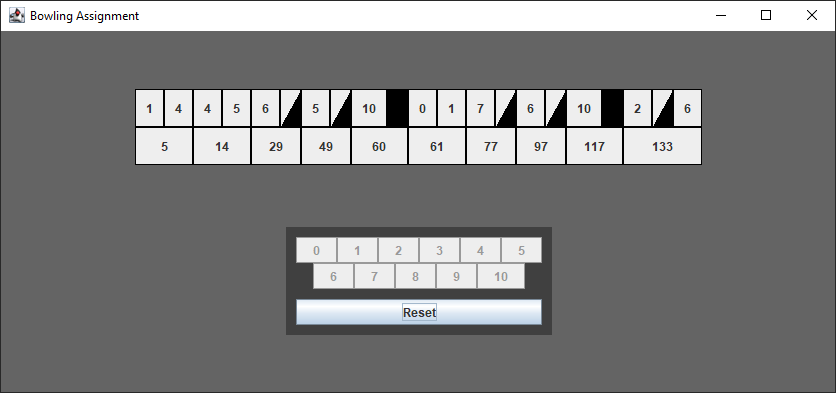

# Bowling Assignment



## Main Algorithm

The first thing I wanted to do was to read the definition carefully and extract the input and output parameters. I decided to use integer arrays to store the values.    

```Java
int[] getAllFrames(int[] scores)
```

This way, I was able to create test cases that would then serve as benchmarks for the quality of the algorithm. I chose JUnit tests here because they provide a simple and easy way to test the logical parts of the software: 
[Tests](BowlingAssignmentJava\src\test\java\FrameCalculatorTest.java)

Next, I thought about the algorithm itself. To do this, I looked at the definition and some examples to find information like this: 

- There is a maximum of 10 frames and 21 balls
- There is no static relation between the number of balls thrown and finished frames
- Frame scores may need values of the next frame to be calculated
- The last frame is different from the others
  
I came to the conclusion to form a loop over all inputs. In this loop I then distinguished between strikes, spares and normal throws. All that was left was to look for error cases and make sure that all the required points are given before calculating the frame points.
[Algorithm](BowlingAssignmentJava\src\main\java\Logic\FrameCalculator.java)

## Graphical User Interface

After I finished developing the algorithm, I wanted to add a graphical user interface. I didn't want to overdo it, so I decided to use only one Java Swing form.  
The basic idea was to recalculate the frames every time a new input is added and reload the user interface afterwards. [GUI Controller](BowlingAssignmentJava\src\main\java\MainGUI.java)

## Improving the Algorithm

To display all the information on the GUI (and not just the finished frames), I had to rethink the core algorithm. I added a class to store a frame:  

```Java
//Index
private final int frameIndex;
private final boolean isLastFrame;

//Values
private int[] inputScores;
private int frameScore;

//Status
private boolean isFinished;
private boolean isStrike;
private boolean isSpare;
```

I would then create a copy of the algorithm that not only calculates frame scores, but also stores all input values and state information in the frame objects. [Algorithm used for GUI](BowlingAssignmentJava\src\main\java\Logic\GUIFrameCalculator.java)  

## Rendering the UI

With the new improved algorithm, I can use the calculated data for each frame separately and thus create 10 individual frame objects that are displayed side by side in a panel.

## Final touches

Finally, I added some quality of live features:

- Disable button if input would not be valid
- Keyboard inputs
- Show a popup dialog after the game
